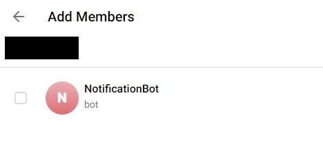
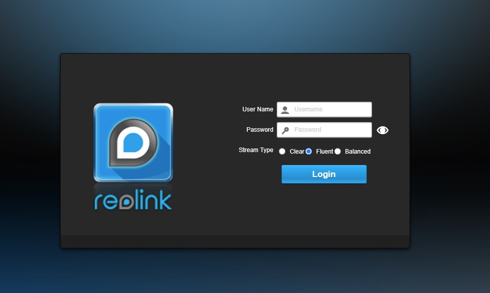
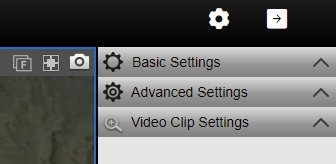
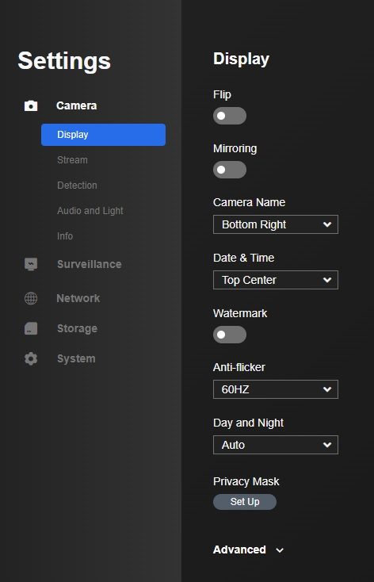

# Ditigally Secure Home Security  

This is a project that uses IP cameras, local computing and the encrypted messaging to monitor a location and get notifications on your phone or desktop with without sending any usable data to outside companies.

The end result will be notifications on your phone that looks like this:


No snooping, no Ring/Amazon subscriptions, no Arlo, no data privacy issues, just fast notifications for you and the people you approve can view these messages/images. 

Things that you will need:

* Reolink cameras, as many as you want, but the system will add 100ms of delay per cameras
* Raspberry pi 4 (any version) starts at $35
* 8+GB microSD
* Power over Ethernet (PoE) network switch (I used TL-SF1008P which supports 4 cameras) $50. Make sure you have enough PoE slots to power the cameras.
* Networking cables
* A way to mount your cameras (drill, screwdriver, etc)
* A telegram account, or just make a new one
* Mini hdmi connector to monitor (expert mode: use ssh for the whole thing)

## Install the Cameras

Make sure you have Reolink cameras because the interface that we use to monitor the streams only works for Reolink.
At the bottom of [this page](https://github.com/ReolinkCameraAPI/reolinkapipy) the current supported camera models is listed, I used RLC-410-5MP cameras. 

This requires drilling and mounting the cameras, and running the networking cables to the PoE switch.  You can use a non-powered switch if you have a power adapter for each camera, but power is not always available where you want to plug in the camera.  Wire your PoE switch to your router if you are going to be using separate devices. 

Camera install may be the most time intensive part but there's nothing I can do to help with that.

## Setting up Raspberry pi 

We are going to be monitoring the camera feeds and running code on the raspberry pi so the first step is set up the raspberry pi.

This requires following [this guide](https://projects.raspberrypi.org/en/projects/raspberry-pi-setting-up/2).

Finish setup to get to the desktop or terminal depending on your preferred settings.

## Setting up the main script

On your raspberry pi, open a terminal window and run the following lines:

```
sudo apt-get install python3
sudo apt-get install git
git clone https://github.com/kennybradley/security.git
cd security
pip3 install -r requirements.txt
```

You will now have the script downloaded along with all of the dependencies, the code is ready to run, but we need to set up the files necessary to start sending out notifications. 


# Setting up telegram

## Part 1 : generate a token

Make/log in to a telegram account, you'll need a phone but you can also do this in a browser.

Send the following messages to the user BotFather: 

* /start
* /newbot
* UniqueNameOfNotification_bot

This will give you a token.  We will be using this to set up our notifications.

It will look something like this 1234567890:ABCDEFGHIJKLMNOPQRSTUVWXYZ123456789

## Part 2 : Set up your pi to send messages

On your pi will need to set up the program telegram-send:
```
pip3 install telegram-send
telegram-send --configure
```

Insert the token that Part 1 gave you.

This will ask you to search for UniqueNameOfNotification_bot on telegram and send a number to confirm setup. Confirming this will allow the raspberry pi to send messages through the bot you just made.

## Part 3 : Getting the group ID 

Being able to send messages is good but sending requires a group ID.

Login on [the web based telegram site](https://web.telegram.org/), it MUST be the web based site.  This will ask you to verify with your phone, go into the telegram app settings, then devices, and click on Link Desktop Device.


At the bottom click on the pencil then New Group Chat.  Add your UniqueNameOfNotification_bot and add whoever you want to be receiving notifications.



Click on the group chat and the URL bar should look like this: https://web.telegram.org/z/#CHARCTERS_HERE

Everything after the # is your group chat ID.

## Part 4 : Finish telegram setup

We need to write out the token and the group chat ID.  Change directories to the security script folder, using my suggested setup: cd /home/pi/security

Update the setup.conf file with the token and group ID.  Open up using gedit by gui or nano/vi/emacs by command line.

Add the token so that it looks like TOKEN=1234567890:ABCDEFGHIJKLMNOPQRSTUVWXYZ123456789
Add the group ID so that it looks like GROUP_ID=CHARACTERS_HERE

# Get the camera IP addresses

In your router (maybe at 192.168.0.1) you'll need to pull up the IP addresses of the cameras that are plugged into the switch.
I can't help too much with this part since each router is set up differently.  You want to look for hard wired connections set up within the last day. 

Grab those IP addresses, you're going to need to log into each camera to set up passwords.

## Configuring the cameras

Insert the IP address into a web browser and you'll be given a landing page to log into the camera.  



The default username is: admin
The default password is empty so leave it blank. 



After you log in click on the gear in the top right.



Then on the left side click on System then User Management.  This will allow you to insert a new password. If you choose to add a new username remember to also reset the password of the admin login.  You don't want to leave that blank.


Update the section of the setup.conf from 
```
IP_ADDRESS=[]
USERNAMES=[]
PASSWORDS=[]
```
to the corresponding login information such as:
```
IP_ADDRESS=[192.168.0.51, 192.168.0.52, 192.168.0.53, 192.168.0.54]
USERNAMES=[userCam1, userCam2, userCam3, userCam4]
PASSWORDS=[pass1, pass2, pass3, pass4]
```

# Finally Running 

## Sanity check

We set up the telegram-send and the bot, we generated a token, a group ID, and set of IP addresses, usersnames and passwords.  Everything should be ready to run.


## Running natively

Open the terminal and 
```
cd /home/pi/security
python runHomeSecurity.py
```

It should give a little bit of output saying that each of the cameras connected.  Feel free to disconnect the monitor cable and let it run.
If you lose power or it gets reset for some reason simply repeat the two lines above to restart the program.


## Running remotely

You can connect to your pi from a windows or other computer by using ssh.  

```
ssh pi@IP_ADDRESS_FOR_PI
```

Log in, then install tmux so we can run the script remotely 

```
sudo apt-get install tmux
tmux
```
Tmux will make a new screen that will persist even after you log out.
The new screen:
```
cd /home/pi/security
python runHomeSecurity.py
```
Then hit control+b followed by d.  This will leave the program running on the pi and allow you to exit the terminal 
